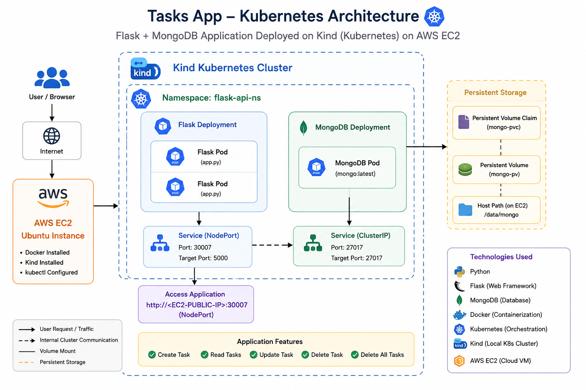
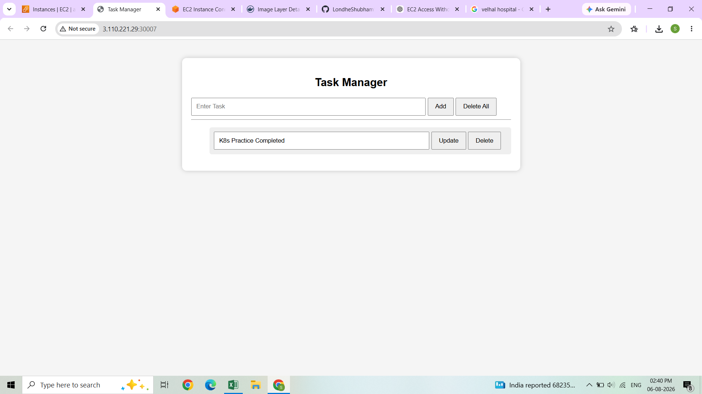
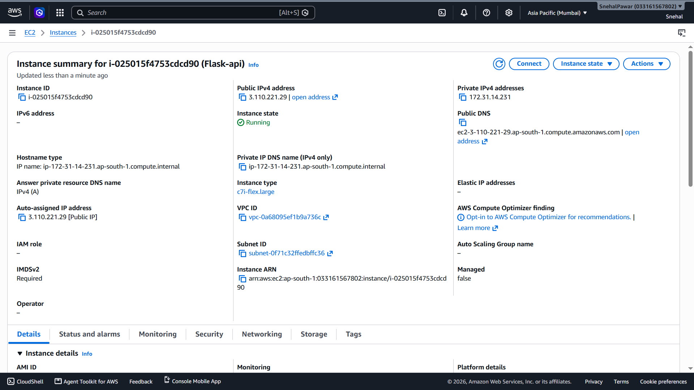
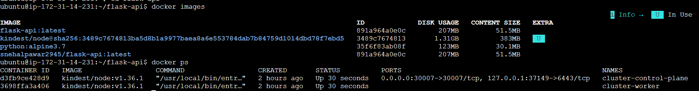
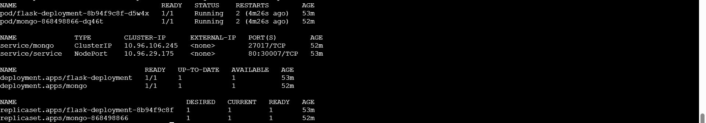

# 🚀 Tasks App on Kubernetes ☸️

<p align="center">


**A complete CRUD Task Manager built with Flask & MongoDB and deployed on Kubernetes (Kind) running on AWS EC2.**

</p>

---

# 📌 Project Overview

This project demonstrates the complete deployment lifecycle of a containerized web application using **Docker** and **Kubernetes**.

### ✨ Features

* ➕ Create Task
* 📋 View Tasks
* ✏️ Update Task
* ❌ Delete Task
* 🗑 Delete All Tasks
* 🐳 Dockerized Application
* ☸️ Kubernetes Deployment
* 🍃 MongoDB Persistent Storage

---

# 🏗️ Architecture

<p align="center">

</p>

---

# 📷 Application Preview

### 🌐 Browser UI

<p align="center">

</p>

---

# ☁️ AWS EC2

<p align="center">

</p>

---

# 🐳 Docker Image

<p align="center">

</p>

---

# ☸️ Kubernetes Pods

<p align="center">

</p>

---

# ⚙️ Tech Stack

| Technology   | Purpose                  |
| ------------ | ------------------------ |
| 🐍 Python    | Backend                  |
| 🌶 Flask     | REST API                 |
| 🍃 MongoDB   | Database                 |
| 🐳 Docker    | Containerization         |
| ☸ Kubernetes | Container Orchestration  |
| 📦 Kind      | Local Kubernetes Cluster |
| ☁ AWS EC2    | Cloud Infrastructure     |

---

# 📂 Project Structure

```text
tasks-app-kubernetes/
│
├── app.py
├── Dockerfile
├── requirements.txt
├── README.md
│
├── templates/
│   └── index.html
│
├── k8s/
│   ├── cluster.yml
│   ├── deployment.yml
│   ├── namespace.yml
│   ├── service.yml
│   ├── mongo.yml
│   ├── mongo-svc.yml
│   ├── mongo-pv.yml
│   └── mongo-pvc.yml
│
└── screenshots/
```

---

# 🚀 Deployment Steps

### 1️⃣ Build Docker Image

```bash
docker build -t flask-api .
```

### 2️⃣ Create Kind Cluster

```bash
kind create cluster --config k8s/cluster.yml
```

### 3️⃣ Deploy Resources

```bash
kubectl apply -f k8s/
```

### 4️⃣ Verify

```bash
kubectl get nodes

kubectl get pods -n flask-api-ns

kubectl get svc -n flask-api-ns
```

---

# 🌐 Access Application

```text
http://<EC2-PUBLIC-IP>:30007
```

---

# 📡 REST API

| Method | Endpoint        | Description      |
| ------ | --------------- | ---------------- |
| GET    | `/tasks`        | Get all tasks    |
| POST   | `/task`         | Create task      |
| PUT    | `/task/{id}`    | Update task      |
| DELETE | `/task/{id}`    | Delete task      |
| POST   | `/tasks/delete` | Delete all tasks |

---

# ☸️ Kubernetes Resources

* 📦 Namespace
* 🚀 Deployment
* 📄 Pod
* 🌐 NodePort Service
* 💾 Persistent Volume
* 💽 Persistent Volume Claim
* 🍃 MongoDB Deployment

---

# 🧠 Key Concepts Learned

* ✅ Docker Image Creation
* ✅ Docker Containers
* ✅ Kubernetes Pods
* ✅ Deployments
* ✅ Services
* ✅ NodePort
* ✅ Namespaces
* ✅ Persistent Volumes (PV)
* ✅ Persistent Volume Claims (PVC)
* ✅ MongoDB Integration
* ✅ Container Networking
* ✅ AWS EC2 Deployment

---

# 📈 Future Improvements

* 🔹 Ingress Controller
* 🔹 NGINX Ingress
* 🔹 Helm Charts
* 🔹 GitHub Actions CI/CD
* 🔹 Horizontal Pod Autoscaler
* 🔹 Prometheus & Grafana Monitoring
* 🔹 Amazon EKS Deployment

---

# 👨‍💻 Author

**Snehal Pawar**

💼 Master's Student | Full Stack & Cloud Enthusiast

⭐ If you found this project useful, consider giving it a **Star** on GitHub!
